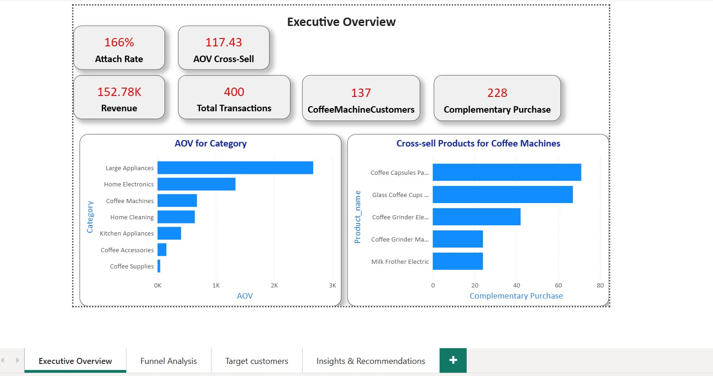
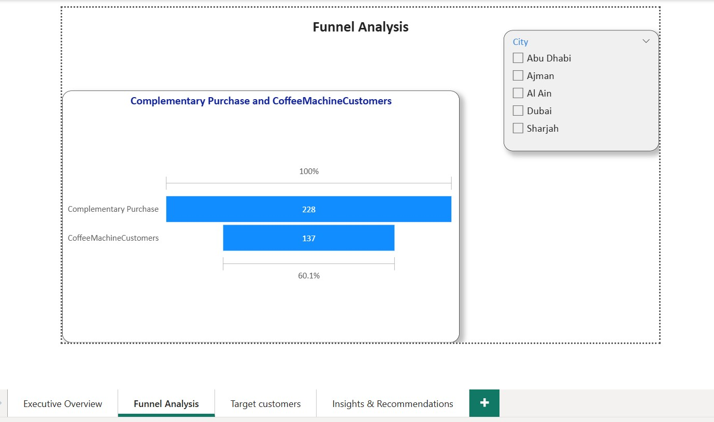
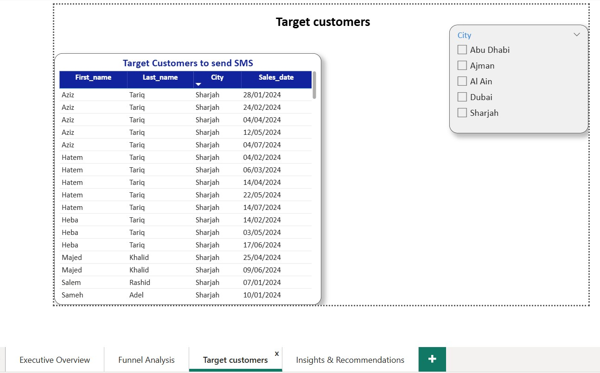
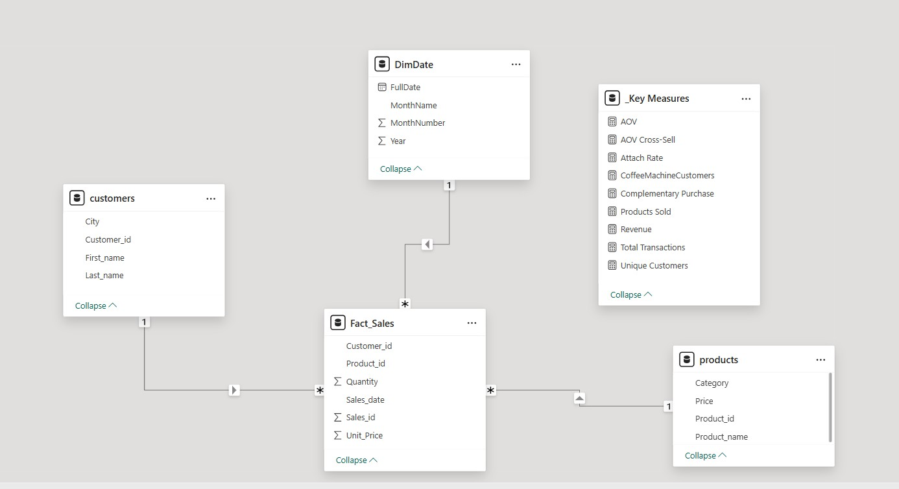

## 📦Basket Analysis Cross-Sell

## 📌 Project Overview
This project analyzes market basket behavior to identify products most frequently purchased alongside coffee machines, with the objective of increasing (AOV).

## Problem
The Average Order Value (AOV) for the coffee accessories category is lower than expected, indicating that customers purchasing coffee machines are not consistently adding complementary accessories to their orders, resulting in missed cross-selling and revenue opportunities.

## 🚀 The Hypothesis
If customers who purchase coffee machines are targeted with personalized promotions, bundles, or discounts on complementary coffee accessories, then the attachment rate of accessories will increase, leading to a higher AOV for the coffee accessories category.

##  📊 Key Insights
1.Funnel analysis identified 228 customers who purchased complementary products and 137 customers who purchased coffee machines, indicating that 40% of potential cross-selling opportunities are lost.
Additionally, 151 customers purchased coffee machines but did not return to buy complementary products, representing a significant untapped upselling opportunity.

2.The analysis shows that several complementary items have strong standalone demand, particularly Coffee Capsules Pack (10) and Classic Coffee Cups Set, indicating high potential for bundling or targeted promotions.

## Recommendations
Implement targeted SMS campaigns for customers who purchased coffee machines but have not yet bought complementary products, offering limited-time discounts or bundle deals.
Create product bundles combining coffee machines with high-demand complementary items to encourage immediate add-on purchases.
Monitor conversion rates after campaign execution to measure the impact on AOV and repeat purchase behavior.

## 🛠️ Tools Used
Power BI: Data Modeling, Visualization, and Dashboarding.

DAX (Data Analysis Expressions): Advanced measures for calculating AOV Cross-Sel,Revenue and Attach Rate.

Power Query: For cleaning and transforming raw procurement and production data.

PBIP Format: Professional project structure for version control on GitHub.

---

## 📷 Dashboard Preview

## Page 2 Preview

## Page3 Preview

## Page4 Preview

## Data Model Preview

